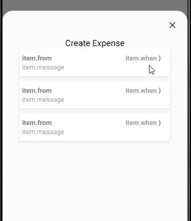
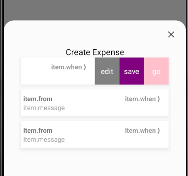
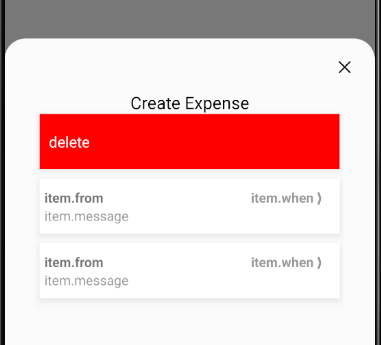

- A dynamic button view that can be swiped left and right to reveal hidden actions.
  left action can be swiped to end like in instegram/gmail/facebook messages/comments.

- It comes with a built-in TypeScript typings and is compatible with all popular JavaScript frameworks. You can use it directly or leverage well-maintained wrapper packages that allow for a more native integration with your frameworks of choice.

# Example:

## ActionButton props

| Name        | Type       | Default |
| ----------- | ---------- | ------- |
| name        | string     |
| onPress     | () => void |
| buttonStyle | ViewStyle; |
| textStyle   | TextStyle; |

## SwipeActionsButtonProps props

| Name                                | Type           | Default |
| ----------------------------------- | -------------- | ------- |
| rightActions                        | ActionButton[] |
| leftAction                          | ActionButton   |
| leftThreshold                       | number         |
| rightThreshold                      | number         |
| rightActionsTotalWidthInPrecentages | string         |
| onPressButton                       | () => void     |
| onEndSwipeLeft                      | () => void     |
| style                               | ViewStyle      |
